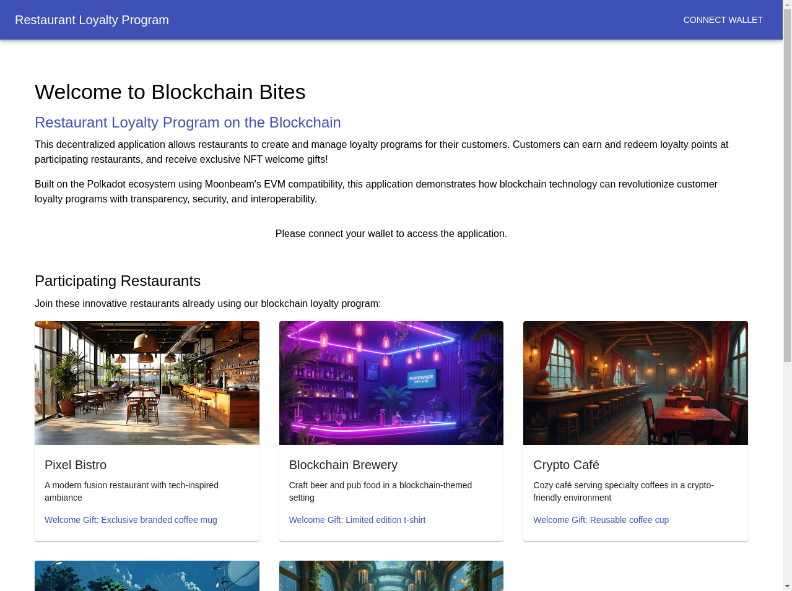
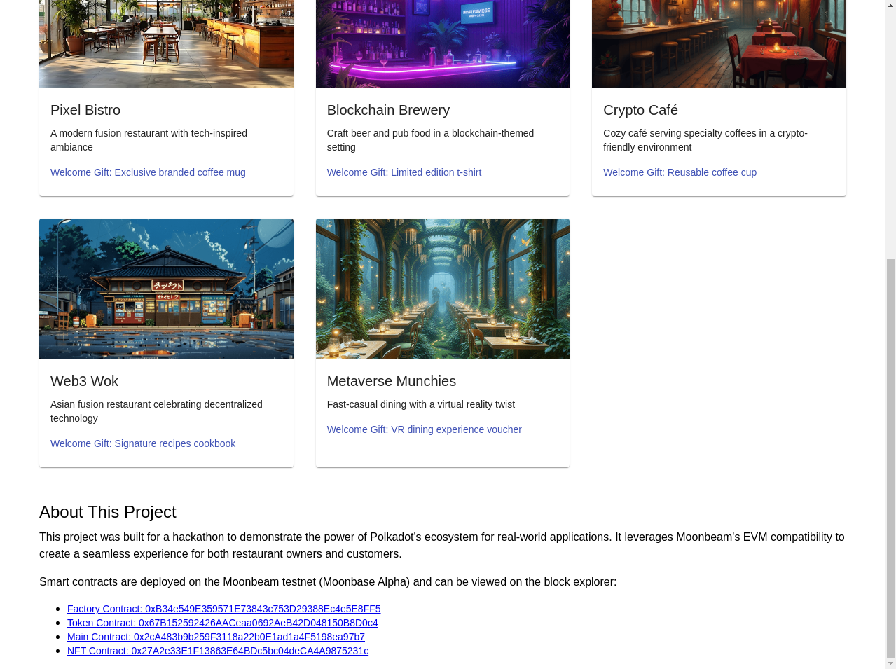

# Blockchain Bites - Restaurant Loyalty Program



A blockchain-based loyalty program system for restaurants built on the Moonbeam network (Polkadot ecosystem). This application allows restaurants to create loyalty programs where customers can earn and redeem points for their purchases and engagement, while also receiving exclusive NFT welcome gifts when they join.

## 📝 Project Overview

Blockchain Bites revolutionizes traditional restaurant loyalty programs by leveraging blockchain technology to create a transparent, secure, and interoperable system. Our platform solves several key problems in the restaurant industry:

1. **Fragmented Loyalty Programs**: Traditional loyalty programs are siloed, forcing customers to manage multiple cards or apps. Our solution unifies loyalty programs across multiple restaurants.

2. **Trust and Transparency Issues**: Conventional programs lack transparency in point calculation and redemption. Blockchain provides immutable records of all transactions.

3. **Customer Engagement**: Traditional programs often fail to create meaningful engagement. Our NFT welcome gifts provide immediate value to new customers.

4. **Program Management Complexity**: Restaurant owners struggle with technical implementation. Our platform simplifies program creation and management.

## 🎬 Demo Video

[](https://www.youtube.com/watch?v=DEMO_VIDEO_ID)

*Click the image above to watch the demo video*

## 📸 Screenshots

### Landing Page


### Customer Dashboard


### Restaurant Dashboard


### NFT Welcome Gifts


## 🔧 How Our Smart Contracts Work

Our application consists of four main smart contracts:

1. **RestaurantLoyaltyToken (ERC20)**: 
   - Implements the loyalty points as ERC20 tokens
   - Allows for transferability between users
   - Includes minting and burning functions for point issuance and redemption
   - Deployed at: [0x67B152592426AACeaa0692AeB42D048150B8D0c4](https://moonbase.moonscan.io/address/0x67B152592426AACeaa0692AeB42D048150B8D0c4)

2. **RestaurantWelcomeNFT (ERC721)**:
   - Implements welcome gifts as NFTs using the ERC721 standard
   - Includes metadata for each NFT representing different restaurant merchandise
   - Tracks redemption status to prevent double-redemption
   - Deployed at: [0x27A2e33E1F13863E64BDc5bc04deCA4A9875231c](https://moonbase.moonscan.io/address/0x27A2e33E1F13863E64BDc5bc04deCA4A9875231c)

3. **RestaurantLoyalty**:
   - Core contract managing restaurants, customers, and loyalty operations
   - Handles restaurant registration and profile management
   - Manages customer registration and point tracking
   - Coordinates point awarding and redemption
   - Manages NFT welcome gift issuance and redemption
   - Deployed at: [0x2cA483b9b259F3118a22b0E1ad1a4F5198ea97b7](https://moonbase.moonscan.io/address/0x2cA483b9b259F3118a22b0E1ad1a4F5198ea97b7)

4. **RestaurantLoyaltyFactory**:
   - Factory pattern contract for easy deployment
   - Creates and initializes all other contracts
   - Manages contract relationships and permissions
   - Deployed at: [0xB34e549E359571E73843c753D29388Ec4e5E8FF5](https://moonbase.moonscan.io/address/0xB34e549E359571E73843c753D29388Ec4e5E8FF5)

### Contract Interaction Flow

1. **Restaurant Registration**:
   - Restaurant owner calls `registerRestaurant()` with name, description, and welcome NFT URI
   - Contract creates restaurant profile and assigns owner permissions
   - Restaurant can now award points and manage their loyalty program

2. **Customer Registration**:
   - Customer calls `registerCustomer()` with name and selected restaurant
   - Contract creates customer profile and mints welcome NFT from selected restaurant
   - Customer can now earn and redeem points across all participating restaurants

3. **Point Management**:
   - Restaurants award points via `awardPoints()` function
   - Points are minted as ERC20 tokens to customer's wallet
   - Customers can redeem points via `redeemPoints()` function
   - Points are burned upon redemption

4. **NFT Welcome Gifts**:
   - NFTs are minted during customer registration
   - Each NFT represents a specific merchandise item from the restaurant
   - Customers can redeem NFTs via `redeemWelcomeNFT()` function
   - NFT redemption status is tracked to prevent double-redemption

## 🚀 How Polkadot Was Used

This project leverages the Polkadot ecosystem through Moonbeam's EVM compatibility:

1. **Moonbeam Network**: We deployed our contracts on Moonbase Alpha (Moonbeam's testnet), which provides full Ethereum compatibility while being part of the Polkadot ecosystem.

2. **Cross-Chain Potential**: While currently deployed on Moonbeam, the architecture allows for future expansion to other Polkadot parachains through XCM (Cross-Consensus Messaging).

3. **Scalability and Low Fees**: Moonbeam's connection to Polkadot provides better scalability and lower transaction fees compared to Ethereum mainnet.

4. **Security**: Leverages Polkadot's shared security model through Moonbeam's connection to the relay chain.

## 💻 Technology Stack

- **Blockchain**: Moonbeam Network (Polkadot Ecosystem)
- **Smart Contracts**: Solidity, Hardhat
- **Frontend**: React.js, Material-UI
- **Web3 Integration**: ethers.js, MetaMask
- **Testing**: Hardhat, Chai

## 📁 Project Structure

```
restaurant-loyalty-app/
├── contracts/                # Smart contract source code
│   └── src/
│       ├── RestaurantLoyalty.sol
│       ├── RestaurantLoyaltyToken.sol
│       ├── RestaurantLoyaltyFactory.sol
│       └── RestaurantWelcomeNFT.sol
├── scripts/                  # Deployment and interaction scripts
│   ├── deploy.js
│   ├── deploy-with-nft.js
│   └── fictional-restaurants.js
├── test/                     # Smart contract tests
│   ├── RestaurantLoyalty.js
│   └── RestaurantLoyaltyWithNFT.js
├── frontend/                 # React frontend application
│   ├── public/
│   └── src/
│       ├── components/       # UI components
│       ├── contexts/         # React contexts
│       └── contracts/        # Contract ABIs
├── docs/                     # Documentation
│   ├── architecture.md       # System architecture
│   ├── research.md           # Research findings
│   └── technical-documentation.md
├── screenshots/              # UI screenshots
└── hardhat.config.js         # Hardhat configuration
```

## 🏁 Getting Started

### Prerequisites

- Node.js and npm
- MetaMask browser extension
- Moonbase Alpha testnet configured in MetaMask

### Installation

1. Clone the repository
   ```
   git clone https://github.com/p-chandler/restaurant-loyalty-app.git
   cd restaurant-loyalty-app
   ```

2. Install dependencies
   ```
   npm install
   ```

3. Compile the smart contracts
   ```
   npx hardhat compile
   ```

4. Run tests
   ```
   npx hardhat test
   ```

### Deployment

1. Deploy to Moonbase Alpha testnet
   ```
   npx hardhat run scripts/deploy-with-nft.js --network moonbase
   ```

2. Start the frontend application
   ```
   cd frontend
   npm install
   npm start
   ```

## 🎯 Features

### For Restaurant Owners:
- Register your restaurant on the blockchain
- Create and manage your loyalty program
- Define welcome NFT gifts for new customers
- Award points to customers for purchases and engagement
- View customer activity and redemption analytics

### For Customers:
- Register as a customer and select a restaurant for welcome NFT
- Connect your MetaMask wallet
- Receive a welcome NFT that can be redeemed for merchandise
- Earn points by dining at participating restaurants
- Redeem points for rewards at any participating restaurant
- View and manage your NFT collection

## 🔗 Block Explorer Links

All smart contracts are deployed on the Moonbase Alpha testnet:

- **Factory Contract**: [0xB34e549E359571E73843c753D29388Ec4e5E8FF5](https://moonbase.moonscan.io/address/0xB34e549E359571E73843c753D29388Ec4e5E8FF5)
- **Token Contract**: [0x67B152592426AACeaa0692AeB42D048150B8D0c4](https://moonbase.moonscan.io/address/0x67B152592426AACeaa0692AeB42D048150B8D0c4)
- **Main Contract**: [0x2cA483b9b259F3118a22b0E1ad1a4F5198ea97b7](https://moonbase.moonscan.io/address/0x2cA483b9b259F3118a22b0E1ad1a4F5198ea97b7)
- **NFT Contract**: [0x27A2e33E1F13863E64BDc5bc04deCA4A9875231c](https://moonbase.moonscan.io/address/0x27A2e33E1F13863E64BDc5bc04deCA4A9875231c)

## 📝 License

This project is licensed under the MIT License - see the LICENSE file for details.

## 🙏 Acknowledgments

- Polkadot and Moonbeam Network for providing the blockchain infrastructure
- OpenZeppelin for secure smart contract libraries
- The hackathon organizers for the opportunity to showcase this project
